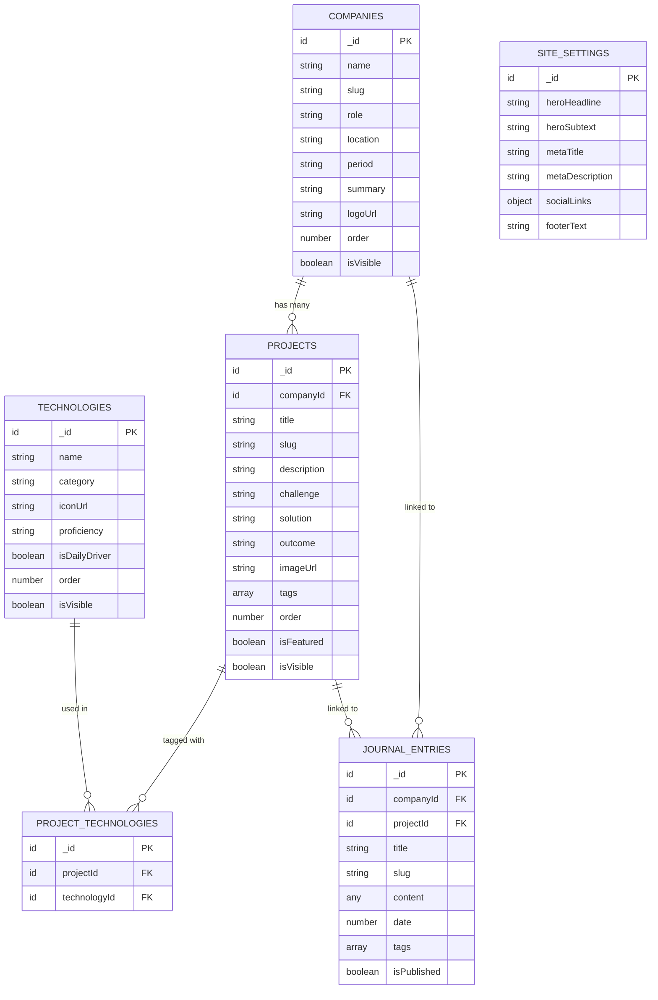

# Data Model & Schema

## Convex Schema Definition

The following schema defines all tables, fields, indexes, and relationships for the Convex deployment.

### Entity Relationship Diagram

## Table Definitions

### companies

| Field | Type | Required | Description |
|-------|------|----------|-------------|
| `name` | `v.string()` | ✅ | Company display name |
| `slug` | `v.string()` | ✅ | URL-safe identifier (auto-generated from name) |
| `role` | `v.string()` | ✅ | Divyasimha's role at this company |
| `location` | `v.string()` | ✅ | Company location |
| `period` | `v.string()` | ✅ | Employment period (e.g., "Oct 2023 – Sep 2025") |
| `summary` | `v.string()` | ✅ | Brief company/role description |
| `logoUrl` | `v.optional(v.string())` | ❌ | External URL to company logo |
| `order` | `v.number()` | ✅ | Display sort order |
| `isVisible` | `v.boolean()` | ✅ | Controls public visibility |

**Indexes:**
- `by_slug` → `["slug"]` — for public page routing
- `by_order` → `["order"]` — for sorted listing

### projects

| Field | Type | Required | Description |
|-------|------|----------|-------------|
| `companyId` | `v.id("companies")` | ✅ | FK to parent company |
| `title` | `v.string()` | ✅ | Project title |
| `slug` | `v.string()` | ✅ | URL-safe identifier |
| `description` | `v.string()` | ✅ | Brief project description |
| `challenge` | `v.optional(v.string())` | ❌ | Rich text: the problem |
| `solution` | `v.optional(v.string())` | ❌ | Rich text: the approach |
| `outcome` | `v.optional(v.string())` | ❌ | Rich text: the results |
| `imageUrl` | `v.optional(v.string())` | ❌ | External URL to project image |
| `tags` | `v.array(v.string())` | ✅ | String tags for categorization |
| `order` | `v.number()` | ✅ | Display sort order |
| `isFeatured` | `v.boolean()` | ✅ | Shows on landing page |
| `isVisible` | `v.boolean()` | ✅ | Controls public visibility |

**Indexes:**
- `by_slug` → `["slug"]` — for public page routing
- `by_company` → `["companyId"]` — for company detail pages
- `by_order` → `["order"]` — for sorted listing
- `by_featured` → `["isFeatured"]` — for landing page queries

### technologies

| Field | Type | Required | Description |
|-------|------|----------|-------------|
| `name` | `v.string()` | ✅ | Technology name |
| `category` | `v.string()` | ✅ | One of: frontend, backend, database, devops, mobile, tools |
| `iconUrl` | `v.optional(v.string())` | ❌ | External URL to tech icon |
| `proficiency` | `v.string()` | ✅ | One of: expert, advanced, intermediate, learning |
| `isDailyDriver` | `v.boolean()` | ✅ | Highlights primary tools |
| `order` | `v.number()` | ✅ | Display sort order within category |
| `isVisible` | `v.boolean()` | ✅ | Controls public visibility |

**Indexes:**
- `by_category` → `["category"]` — for grouped display
- `by_order` → `["order"]` — for sorted listing

### projectTechnologies (Junction Table)

| Field | Type | Required | Description |
|-------|------|----------|-------------|
| `projectId` | `v.id("projects")` | ✅ | FK to project |
| `technologyId` | `v.id("technologies")` | ✅ | FK to technology |

**Indexes:**
- `by_project` → `["projectId"]` — for project detail tech tags
- `by_technology` → `["technologyId"]` — for tech grid project counts

### journalEntries

| Field | Type | Required | Description |
|-------|------|----------|-------------|
| `companyId` | `v.optional(v.id("companies"))` | ❌ | Optional FK to company |
| `projectId` | `v.optional(v.id("projects"))` | ❌ | Optional FK to project |
| `title` | `v.string()` | ✅ | Entry title |
| `slug` | `v.string()` | ✅ | URL-safe identifier |
| `content` | `v.any()` | ✅ | Tiptap JSON from Novel editor |
| `date` | `v.number()` | ✅ | Unix timestamp for publication date |
| `tags` | `v.array(v.string())` | ✅ | String tags |
| `isPublished` | `v.boolean()` | ✅ | Draft vs published |

**Indexes:**
- `by_slug` → `["slug"]` — for public page routing
- `by_project` → `["projectId"]` — for project timeline
- `by_company` → `["companyId"]` — for company timeline
- `by_date` → `["date"]` — for chronological listing
- `by_published` → `["isPublished"]` — for public vs draft filtering

### siteSettings (Singleton)

| Field | Type | Required | Description |
|-------|------|----------|-------------|
| `heroHeadline` | `v.string()` | ✅ | Landing page hero headline |
| `heroSubtext` | `v.string()` | ✅ | Landing page hero subtitle |
| `metaTitle` | `v.string()` | ✅ | Default meta title |
| `metaDescription` | `v.string()` | ✅ | Default meta description |
| `socialLinks` | `v.object({...})` | ✅ | LinkedIn, GitHub, Twitter URLs |
| `footerText` | `v.string()` | ✅ | Footer content |

**Singleton Pattern:** Query always returns the first (and only) document. Mutation upserts: creates if not exists, updates if exists.

## Convex Functions Map

### Queries (Read Operations)

| Function | Description | Used By |
|----------|-------------|---------|
| `companies.list` | All companies sorted by order | Admin list, public pages |
| `companies.getBySlug` | Single company by slug | Public company detail |
| `companies.get` | Single company by ID | Admin edit form |
| `projects.list` | All projects sorted by order | Admin list |
| `projects.listFeatured` | Featured + visible projects | Public landing page |
| `projects.getBySlug` | Single project by slug | Public project detail |
| `projects.getByCompany` | Projects for a company | Company detail page |
| `projects.get` | Single project by ID | Admin edit form |
| `technologies.list` | All technologies by category | Admin list, public grid |
| `technologies.getByProject` | Technologies for a project (via junction) | Project detail page |
| `projectTechnologies.getByProject` | Junction records for project | Project form |
| `journalEntries.list` | All entries sorted by date | Admin list |
| `journalEntries.listPublished` | Published entries only | Public pages |
| `journalEntries.getBySlug` | Single entry by slug | Public journal detail |
| `journalEntries.getByProject` | Entries for a project | Project timeline |
| `journalEntries.getByCompany` | Entries for a company | Company timeline |
| `journalEntries.get` | Single entry by ID | Admin edit form |
| `siteSettings.get` | Site settings singleton | Landing page, meta tags |

### Mutations (Write Operations — All Require Admin Auth)

| Function | Description |
|----------|-------------|
| `companies.create` | Create company with auto-generated slug |
| `companies.update` | Update company fields |
| `companies.remove` | Delete company (validates no linked projects) |
| `projects.create` | Create project with company link |
| `projects.update` | Update project fields |
| `projects.remove` | Delete project (cascade delete junction records) |
| `technologies.create` | Create technology entry |
| `technologies.update` | Update technology fields |
| `technologies.remove` | Delete technology (cascade delete junction records) |
| `projectTechnologies.set` | Replace all tech links for a project |
| `journalEntries.create` | Create journal entry |
| `journalEntries.update` | Update journal entry |
| `journalEntries.remove` | Delete journal entry |
| `siteSettings.update` | Upsert site settings singleton |
