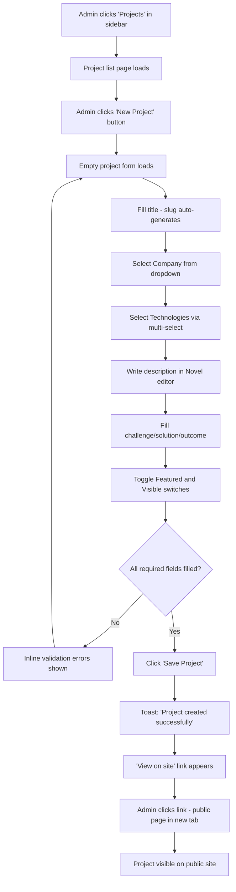
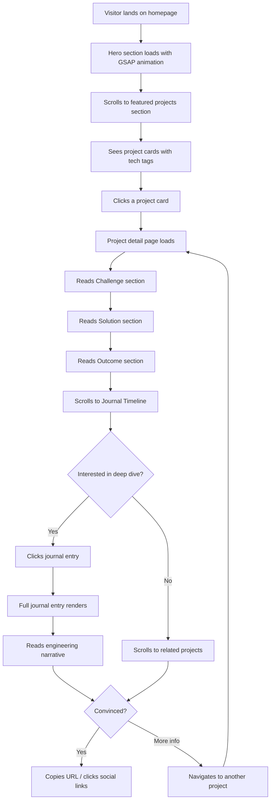
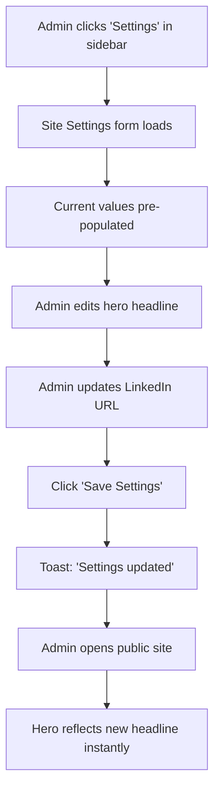
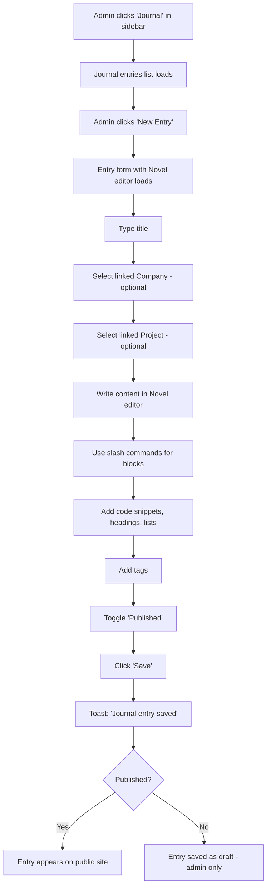

# User Journey Flows

## Journey 1: Admin Creates a New Project

## Journey 2: Visitor Evaluates Portfolio

## Journey 3: Admin Updates Site Settings

## Journey 4: Admin Writes a Journal Entry

## Journey Patterns

### Common Admin Patterns
- **Entry point:** Always sidebar click → list page → action button
- **Form pattern:** Metadata fields first, rich text content second, toggles last
- **Completion:** Toast notification → "View on site" link → back to list
- **Error handling:** Inline validation, never lose typed content

### Common Visitor Patterns
- **Entry point:** Homepage hero → scroll → card click OR direct URL from shared link
- **Reading pattern:** Skim headline → read challenge → read solution → check technologies
- **Decision pattern:** 2-3 projects scanned before making a judgment
- **Exit pattern:** Copy URL to share, or click social links for direct contact

## Flow Optimization Principles

1. **Zero-step publishing** — Toggle "Published" + Save. No review queue, no approval flow. Solo operator.
2. **Smart defaults** — Slug auto-generates from title. Display order auto-increments. Visibility defaults to true.
3. **Relationship shortcuts** — When creating a journal entry from a project page, auto-populate the project link.
4. **Progressive loading** — Public detail pages load above-fold content first, journal timeline lazy-loads below.
